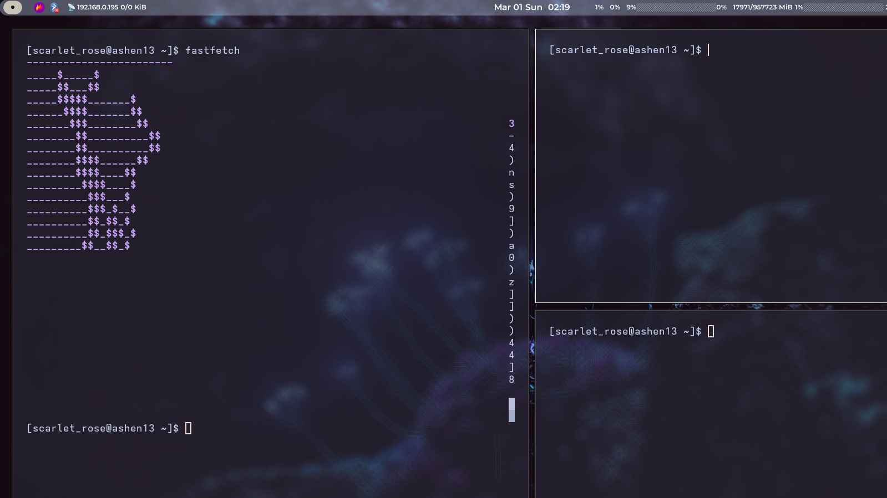

# 🌸 Ashen13 | Arch Linux + Hyprland 

Welcome to my workspace! This is a custom-tailored environment focused on aesthetics, productivity, and a touch of lavender.

## 🛠 System Specs
* **OS:** Arch Linux
* **WM:** Hyprland (Wayland)
* **Terminal:** Kitty
* **Shell:** Zsh / Bash
* **Theme:** Catppuccin Mocha (Lavender Accents)

## 🎨 Visuals & Components
* **Dock:** `nwg-dock-hyprland` — fully customized with lavender borders and auto-hide.
* **Application Launcher:** `nwg-drawer` — a modern, semi-transparent grid with blur effects.
* **Bar:** `Waybar` — custom CSS for a clean, floating aesthetic.
* **Icons:** Papirus-Dark (for that crisp, modern look).

## ⚙️ Key Features
* **Custom Rules:** Window rules for blur, opacity, and centered floating windows.
* **XWayland Tweaks:** Forced zero-scaling for pixel-perfect clarity in older apps.
* **Workflow:** Integrated SSH for seamless Git contributions.

---
*Stay cozy. Stay productive.* 💜
